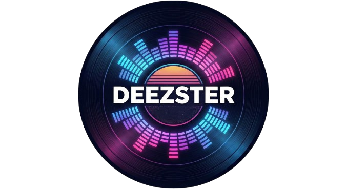

<div align="center">

# 💿 DEEZSTER 4.1
### The Ultimate Music Quiz Collection



[**🔴 LIVE DEMO HIER KLICKEN**](https://bastiancurth.github.io/deezster/)

</div>

---

## 🎵 Was ist Deezster?

**Deezster** ist die Weiterentwicklung des klassischen Musik-Timelinespiels zu einer vollwertigen Party-App. Es läuft zu 100% im Browser (keine Installation nötig) und nutzt die Deezer-Bibliothek für unendlichen Musiknachschub.

Die **Version 4.1 (Ultimate Edition)** bringt ein komplett neues **High-Contrast Glassmorphism Design**, einen **Musik-Visualizer**, der auf den Beat reagiert, und insgesamt **6 verschiedene Spielmodi**.

## ✨ Neu in Version 4.1

* **🎨 Desktop-Hybrid Design:** Sieht auf dem Smartphone wie eine App aus, nutzt auf dem Desktop aber den Platz optimal.
* **🌈 Reactive Visualizer:** Der Hintergrund pulsiert und ändert die Geschwindigkeit, sobald Musik läuft ("Party Mode").
* **👁️ High Contrast UI:** Maximale Lesbarkeit durch optimierte Kontraste und Typografie trotz Glas-Effekt.
* **🧠 Smart Algorithm:**
    * **ISRC-Fix:** Erkennt das *echte* Aufnahmejahr (statt Remaster-Datum).
    * **Duplicate-Filter:** Verhindert, dass beim Quiz der gleiche Künstler/Titel doppelt als Antwort erscheint.

---

## 🎮 Die 6 Spielmodi

Deezster ist nicht mehr nur ein Zeitstrahl-Spiel. Wähle aus 6 Varianten:

### 1. 📅 Timeline (Der Klassiker)
* **Ziel:** Ordne Songs chronologisch auf deinem Zeitstrahl ein.
* **Gameplay:** Entscheide: War der Song *vor* oder *nach* den liegenden Karten?
* **System:** 3 Leben. Wer 10 Karten korrekt legt, gewinnt.

### 2. ⚡ Highscore Quiz
* **Ziel:** Errate den Songtitel aus 4 Möglichkeiten.
* **Score:** Je schneller du klickst, desto mehr Punkte (Dynamischer Timer-Balken).
* **Modus:** Sudden Death! Ein Fehler und das Spiel ist vorbei.

### 3. ⬆️⬇️ High / Low
* **Ziel:** Simpel und schnell. Ist der neue Song **ÄLTER** oder **NEUER** als der angezeigte?
* **System:** Baue eine "Streak" (Serie) auf, ohne Fehler zu machen.

### 4. ⏱️ 1-Second Challenge
* **Ziel:** Für Profis. Du hörst nur **die erste Sekunde**.
* **Gameplay:** Erkennst du es sofort? Oder kaufst du dir für Minuspunkte mehr Zeit (+3 Sek)?

### 5. 🖼️ Cover Blur
* **Ziel:** Ein visuelles Rätsel. Das Cover ist extrem unscharf.
* **Gameplay:** Während die Musik läuft, wird das Bild langsam schärfer. Wer erkennt den Künstler zuerst?

### 6. ⚔️ Party Duell (1 vs 1)
* **Ziel:** Lokaler Multiplayer an einem Gerät.
* **Gameplay:** Ein Song läuft. Spieler 1 und Spieler 2 tippen geheim das Jahr ein. Wer näher dran ist, kriegt den Punkt.

---

## 🛠️ Technologie

Das Projekt ist "Serverless" und läuft client-seitig.

* **Frontend:** HTML5, CSS3, Vanilla JS.
* **API:** Deezer API (via JSONP – **kein Proxy-Server mehr nötig!**).
* **Hosting:** Optimiert für GitHub Pages.

### Installation

1.  Repository klonen oder ZIP herunterladen.
2.  `index.html` auf einen Webserver oder GitHub Pages hochladen.
3.  Fertig!

---

## 🤓 Deep Dive: Der "Smart-Fix"

Warum Deezster besser funktioniert als andere Klone:

**1. Das Remaster-Problem:**
Musik-APIs liefern oft das Jahr "2011" für einen Song von "1975", weil er auf einem "Best Of" Album war. Deezster prüft den **ISRC-Code** (International Standard Recording Code) in den Metadaten. Die Zeichen 6 & 7 des Codes stehen oft für das Produktionsjahr.

```javascript
// Pseudo-Code Logic
if (isrcYear < albumYear && isrcYear > 1900) {
    jahr = isrcYear; // Nimm das echte Jahr!
}
